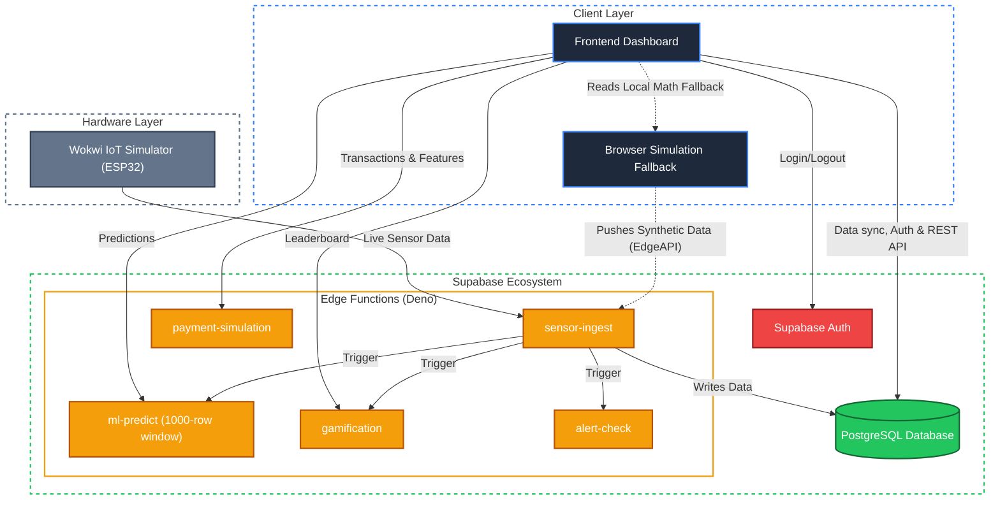

# SaveHydroo 

**Smart Water Blending and Monitoring System**

A smart water management system that blends RO reject water with rainwater to achieve optimal TDS levels. Now powered by **Azure Container Apps** and **Supabase**.


##  System Architecture



##  Features

### Real-Time Live Sync
- **3 Tank System**: RO Reject, Rainwater, and Blended tanks
- **Data Ingestion**: Wokwi IoT Simulator + Sensor Edge Ingest
- **Live Database**: Dashboard fetches exclusively from live Supabase Tables
- **Authentication**: Secure Google OAuth and Magic Link Login via Supabase Auth

### Machine Learning via Edge Functions
- **Advanced Trained Predictor**: Data-driven Linear Regression weights trained on a high-fidelity **20,000-row** dataset.
- **Deep Historical Context**: Analyzes a sliding window of the last **1,000 readings** to identify long-term trends and anomalies.
- **Short-term Ensemble**: ARIMA, WMA, Kalman filters running on Supabase Edge Functions (`ml-predict`) for high-precision 60s forecasts.

### Gamification
- **Points System**: Earn points for water-saving actions
- **5 Levels**: Water Beginner → Aqua Legend
- **Achievements & Badges**: Unlock rewards for milestones
- **Leaderboard**: Compete with other users

### Payment Simulation
- **Credit Packages**: Buy virtual credits
- **Premium Features**: Unlock advanced analytics
- **Donations**: Donate to causes and earn bonus points
- **Transaction History**: Full payment tracking

##  Project Structure

```
savehydroo/
├── simulation/           # Wokwi simulation layer
│   ├── wokwi.toml       # Wokwi configuration
│   ├── diagram.json     # Circuit diagram
│   ├── main.ino         # Arduino code
│   └── sensors.js       # JS data generator
├── frontend/            # Web dashboard
│   ├── index.html       # Main HTML
│   ├── css/styles.css   # Styling
│   └── js/              # JavaScript modules
├── lib/                 # Shared libraries
│   ├── constants.js
│   ├── supabase.js
│   └── ml-predictor.js
├── supabase/
│   ├── functions/       # Edge Functions (ml-predict, gamification, etc.)
│   └── schema.sql       # Database schema
├── data/
│   └── sample-data.json
├── package.json
└── README.md
```

##  Local Development

```bash
# Install dependencies
npm install

# Start development server
npm run dev

# Open browser
http://localhost:3000
```

##  Azure Cloud Deployment (CI/CD)

The application is configured to automatically build and deploy to **Azure Container Apps** every time you push to the `main` branch via GitHub Actions.

### Deployment Prerequisites

To enable automatic deployments, you must configure the following **7 Secrets** in your GitHub Repository under **Settings → Secrets and variables → Actions**:

**Azure Secrets:**
1. `REGISTRY_LOGIN_SERVER`: Example: `yourregistry.azurecr.io`
2. `REGISTRY_USERNAME`: Your Azure Container Registry username
3. `REGISTRY_PASSWORD`: Your Azure Container Registry password
4. `AZURE_CREDENTIALS`: The full JSON output from your Azure Service Principal creation

**Supabase Secrets:**
5. `SUPABASE_URL`: Your Supabase Project URL
6. `SUPABASE_ANON_KEY`: Your Supabase public anon key
7. `SUPABASE_SERVICE_ROLE_KEY`: Your Supabase private service role key (required for Edge Functions)

Once these secrets are active, simply push your code to the `main` branch or manually trigger the `SaveHydroo CI/CD → Azure Container Apps` workflow in the **Actions** tab.

##  Supabase Setup

1. Create a new Supabase project
2. Run `supabase/schema.sql` in the SQL Editor to generate the tables
3. Deploy the Edge Functions: `supabase functions deploy [function-name]`

##  Edge Function Endpoints

| Endpoint | Method | Description |
|----------|--------|-------------|
| `/functions/v1/sensor-ingest` | POST | Accepts live Wokwi sensor data |
| `/functions/v1/ml-predict` | POST | Calculate ML predictions with ensemble model |
| `/functions/v1/gamification` | GET | Leaderboard, User stats, and Achievement evaluation |
| `/functions/v1/payment-simulation` | POST | Virtual credit purchases and feature unlocks |
| `/functions/v1/alert-check` | POST | Verifies real-time thresholds to send user alerts |

##  Gamification Points

| Action | Points |
|--------|--------|
| Use 10L+ rainwater | +10 |
| Reduce RO reject 5% | +15 |
| Maintain optimal TDS 1hr | +20 |
| Daily login streak | +5 × days |

## Tech Stack

- **Frontend**: HTML, CSS, JavaScript, Chart.js
- **Cloud Hosting**: Azure Container Apps (via GitHub Actions CI/CD)
- **Functions**: Supabase Edge Functions (Deno) for ML & Insights
- **Database**: Supabase PostgreSQL (Real-time schema)
- **Authentication**: Supabase Auth (OAuth & Passwordless)
- **IoT Simulator**: Wokwi (Arduino)

## Testing

```bash
# API tests
npm run test:api

# Simulation test
npm run simulate:test
```

##  Screenshots

### Dashboard
- Real-time tank visualization
- Simulated tank Visualization
- Live TDS, temperature, flow metrics
- Interactive blend controls

### Charts
- TDS over time with optimal zone
- Water level trends
- Temperature monitoring

### Gamification
- Level progress with XP bar
- Achievement badges
- Global leaderboard

##  License

MIT License - feel free to use for learning and projects!

---

Built with  for water conservation
